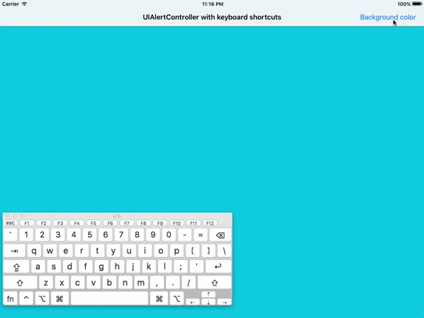

# KeyCommandAlertController
This project contains wrappers for ```UIAlertController``` and ```UIAlertAction``` which allows adding a keyboard shortcut (known as ```key command```).



The following example shows how the action sheet shown above is created:

```swift
let alert = KeyCommandAlertController(title: "Change background color", message: nil, preferredStyle: .actionSheet)

alert.popoverPresentationController?.barButtonItem = sender

let redShortcut = KeyCommandShortcut(input: "B", modifierFlags: .command)
let redAction = KeyCommandAlertAction(title: "Blue", style: .default, keyShortcut: redShortcut) { (action) in
	self.makeBlue()
}

let greenShortcut = KeyCommandShortcut(input: "R", modifierFlags: .command)
let greenAction = KeyCommandAlertAction(title: "Red", style: .default, keyShortcut: greenShortcut) { (action) in
	self.makeRed()
}

let cancelAction = KeyCommandAlertAction(title: "Cancel", style: .cancel)

alert.addAction(redAction)
alert.addAction(greenAction)
alert.addAction(cancelAction)

present(alert, animated: true, completion: nil)
```


### TODO
- [ ] Only show shortcuts in alert actions when external keyboard is connected